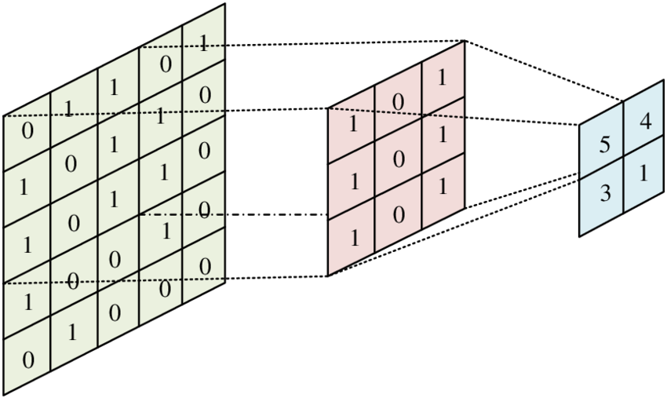

# MO801 -  Trabalho 3

Gabriel Ayres de Oliveira - 234619
 
## A questão da convolução

A convolução é um processo que mede a superposição entre dois sinais, multiplicando as amostras sobrepostas e somando-as. Repete-se esse processo fazendo com que todas as amostras de um dos sinais seja deslizado sobre o outro. No caso aqui fazemos isso para um sinal unidimensional.


Pode-se estender esse conceito para sinais bidimensionais, como imagens, dessa vez sobrepondo um sinal bidimensinal, chamado de *kernel* com parte de uma imagem e repetindo esse processo até que todas as posições da imagem original tenham sido sejam sobrepostas. O resultado é um outro sinal bidimensional, de tamanho levemente menor que o original visto que o kernel só acessa pixels dentro da imagem. Algumas soluções inserem repetições do pixel de borda ou valores fixos às bordas imagem original de forma a manter a imagem original depois da convolução.  



No caso de redes neurais, a utilização de convolução se dá devido a esse processo permitir que vários filtros em cascata aprendam diferentes tamanhos das características buscadas. Um outro motivo quicá mais importante está neste tipo de operação permitir que possa ser calculado o *backpropagation*, cálculo essencial de redes neurais que é a base de seu treinamento.

## Inspiração para o trabalho

O trabalho apresentado por Kästner e Janßen, Hardware/Software Codesign for Convolutional Neural Networks exploiting Dynamic Partial
Reconfiguration on PYNQ, explora o uso de redes neurais em hardware. No caso, explicitamente implementa as convoluções em hardware. A convolução de uma camada da rede pode ser descrito por seis laços, dois deles controlando a movimentação i e j dentro do kernel, dois deles controlando a movimentação x e y dentro dos pixels da imagem. Além destes um dos laços movimenta a convolução nos canais da imagem e outro nos *n* filtros que podem ser definidos para essa operação.


Este trabalho também apresenta uma maneira de fazer a convolução com menos acessos possíveis à memória usando *line buffers* com número de linhas igual ao tamanho do kernel, evitando assim o acesso repetido à memória.


## Implementação
A implementação é feita em C, já levando em conta da falta de memória no processador. A imagem aqui é basicamente uma função placeholder que retorna valores aleatórios. De forma a diminuir o peso em hardware não executaremos divisões, todos os pesos do kernel já estão normalizados.

### Código Base
No código base, faço assim como o descrito pelo autor: usando um buffer de três linhas que é preenchido e realiza as convoluções.
``` c
#define buffer_size (image_size * window_size)
float line_buffer[buffer_size];
```
o *sweep* através da imagem é feito usando loops. O autor sugere que a varredura do buffer aconteça usando dois laços, e isso é feito de forma diferente aqui. Com o buffer na memória, somente a posição do mesmo percorre-a, os elementos são todos acessados usando posições fixas de memória.
```c
if (conv_index < image_size - window_size){
window[0] = line_buffer[conv_index];
window[1] = line_buffer[conv_index + 1];
window[2] = line_buffer[conv_index + 2];

window[3] = line_buffer[conv_index + image_size];
window[4] = line_buffer[conv_index + image_size + 1];
window[5] = line_buffer[conv_index + image_size + 2];

window[6] = line_buffer[conv_index];
window[7] = line_buffer[conv_index + 2 * image_size + 1];
window[8] = line_buffer[conv_index + 2 * image_size + 2];

conv_result = convolution(window, kernel);
//printf("%f", conv_result);
}
```
Devido à esta construção, a convolução nesse trabalho está fixa para um kernel de 3x3 pixels.

De forma a aproximar os resultados do computador e do hardware gerado para o litex, a imagem a ser carregada é uma versão dummy que retorna um gradiente de cima para baixo, da esquerda para a direita.

``` c
float image_pixel(int x, int y, int z){
// Dummy image, if turned into an image,
// will show a gradient from up left to
// lower right.
float result = x / 2 + y / 2;
return result;
}
```

## Execução no computador

De forma a equiparar as versões que rodam no computador e no litex, uma função de convolução é construída de forma a manter a mesma estrutura de chamada de software. Aqui a lógica da função é hardcodada para uma matriz 3x3 de forma a executar sem loops.

```c
float convolution(float window[], float kernel[]){
float result = window[0] * kernel[0] +
                window[1] * kernel[1] +
                window[2] * kernel[2] +
                window[3] * kernel[3] +
                window[4] * kernel[4] +
                window[5] * kernel[5] +
                window[6] * kernel[6] +
                window[7] * kernel[7] +
                window[8] * kernel[8];
return result;
}
```

Nesse caso, o kernel da imagem é instanciado usando um kernel de valores iguais.
```c
float kernel[window_size * window_size] = {0.5, 0.5, 0.5,
                                           0.5, 0.5, 0.5,
                                           0.5, 0.5, 0.5};

```
É interessante observar que esse tipo de kernel tem o mesmo efeito de uma média

### Resultado e  Otimizações no computador

A ideia aqui está em usar no litex o maior tamanho de imagem que a paltaforma suporte. No caso do computador, o tamanho da convolução foi aumentado para uma imagem de 512x512 pixels RGB (três canais), dessa forma criando um software que gaste um tempo considerável. O número de filtros de convolução usado foi de 5. Já é sabido que este tamanho de imagem pode não ser compatível com a simulação do litex. 

Utilizando a compilação padrão e o `time` do linux, observa-se em testes consecutivos que o tempo de execução gira em torno de 50ms.

``` sh
real    0m0.050s
user    0m0.048s
sys     0m0.002s
```

Usando otimizações de compilação, esse tempo cai drasticamente. Para O1:

```sh
real    0m0.007s
user    0m0.004s
sys     0m0.003s
```

Para O2:
```sh
real    0m0.006s
user    0m0.005s
sys     0m0.001s

```

É interessante observar porém, que entre O1 e O2 a diferença de tempo de execução é bem pequena quando comparado com a compilação sem as flags de otimização.


## Executando no litex

### Criando o dispositivo de convolução

De forma a utilizar os recursos de hardware disponíveis, a convolução mostrada anteriormente é substituída por um hardware específico que realiza o cálculo em hardware. Diferente da execução anterior, as multiplicações em ponto flutuante que requerem muitos recursos de hardware são trocadas por multiplicações de ponto fixo. A representação numérica de ponto fixo escolhida é a Q16.16, que usa 16 bits para a parte inteira e 16 bits para a parte fracionária.

É interessante observar que uma quantização deve levar em conta o espaço de valores a ser suportado. Aqui, não usaremos valores muito maiores que 255 para os pixels, logo a representação de 16 bits pode ser exagerada tanto para a parte inteira como a parte fracionária.

O código de convolução é bem parecido com aquele citado anteriormente para o software.

``` verilog
wire [63:0] prod0 = in0 * reg0;
wire [63:0] prod1 = in1 * reg1;
wire [63:0] prod2 = in2 * reg2;
wire [63:0] prod3 = in3 * reg3;
wire [63:0] prod4 = in4 * reg4;
wire [63:0] prod5 = in5 * reg5;
wire [63:0] prod6 = in6 * reg6;
wire [63:0] prod7 = in7 * reg7;
wire [63:0] prod8 = in8 * reg8;

wire [63:0] sum = prod0 + prod1 + prod2 + prod3 + prod4 +
                    prod5 + prod6 + prod7 + prod8;

always @(*) begin
    out = sum[47:16];
end
```
O cálculo se baseia em multiplicações simples, devido ao uso de ponto fixo. Assim como no exemplo de software os pesos devem ser hardcodados previamente. Aqui eles são salvos como registradores.

``` verilog
wire [31:0] reg0 = 32'h00008000; // 0.5 in Q16.16
wire [31:0] reg1 = 32'h00008000; // 0.5 in Q16.16
wire [31:0] reg2 = 32'h00008000; // 0.5 in Q16.16
wire [31:0] reg3 = 32'h00008000; // 0.5 in Q16.16
wire [31:0] reg4 = 32'h00008000; // 0.5 in Q16.16
wire [31:0] reg5 = 32'h00008000; // 0.5 in Q16.16
wire [31:0] reg6 = 32'h00008000; // 0.5 in Q16.16
wire [31:0] reg7 = 32'h00008000; // 0.5 in Q16.16
wire [31:0] reg8 = 32'h00008000; // 0.5 in Q16.16
```

### Usando um script de python para gerar os kernels de convolução
De forma a atualizar rapidamente os pesos, pode-se usar a função `generate_weights` descrita dentro do arquivo `weights_gen.py` para gerar as linhas de verilog equivaletnes aos pesos. A função recebe ou um valor em float que gera um kernel 3x3, uma lista ou uma matriz do numpy que será achatada e gerará as entradas. Para esse trabalho gerou-se com um valor de 0.5, que criou as linhas apresentadas anteriormente.

### Integrando como um core
O litex tem suporte nativo à verilog, mas o código deve ser integrado com a placa a ser utilizada. Usaremos aqui o código de exemplo da placa de simulação litex-sim. Adicionando-o como uma das fontes ao SoC. Esse framework também é bastante rigido em relação à sua nomenclatura, logo esses passos aqui devem ser seguidos.

Como não usaremos uma placa de desenvolvimento, o *litex_sim* servirá como placa dummy para os experimentos. De forma a utilizar o módulo de um verilog, adicionamos um core com a lógica que o integra. Os cores estão localizados em `$LITEX_FOLDER/litex/litex/soc/cores/`, mas não precisam ser necessariamente colocados aqui para funcionarem. 

A definição inicial de um módulo parte sempre da herança da classe original `LiteXModule`. Como vamos usar o CSR como forma de comunicação, precisa-se definir primeiramente as interfaces com o mesmo. As variáveis `CSRStorage` e `CSRStatus` fazem essa comunicação com os registradores.

```python 
//convolution.py (trimmed)
class Conv(LiteXModule):
    def __init__(self):
    self.window0    = CSRStorage(32, name='window0')
    self.result     = CSRStatus(32, name="result")

    self.specials += Instance("convolution",
            i_in0     = self.window0.storage,
            o_out     = self.result.status
        )
```

Logo abaixo estão as definições de porta. O método Instance define o módulo a ser usado. Módulo este que precisa ter tanto seu nome dentro do verilog como o nome do arquivo iguais ao que está sendo mostrado aqui. Do lado esquerdo temos as portas do módulo em verilog e estas precisam **obrigatoriamente** de serem prefixadas por `i` ou `o` de forma que o LiteX saiba a direção de comunicação das mesmas.

Feito isso, edita-se então o módulo do litex_sim localizado em `$LITEX_FOLDER/tools/litex/litex/tools/litex_sim.py` para suportar esse novo dispositivo.

```python
from litex.soc.cores.convolution import Conv
```

O CSR é parte do SOC e as interfaces com o novo módulo devem ser adicionado dentro de sua inicialização.

```python
class SimSoC(SoCCore):
    def __init__(self,...):
        self.conv = Conv()
        self.add_csr("convolution")
```
Neste mesmo local também adiciona-se o arquivo Verilog nas fontes do projeto (visto que foi instanciado aqui).

```python
        platform.add_source("/path/to/file/convolution.v")
```
Com isso, estamos prontos para acessar o hardware. De forma a gerar o código em C que faz a interface, rodamos o litex_sim com alguma CPU para essa compilação gere os headers necessários do CSR.

```sh
litex_sim --cpu-type=vexriscv --integrated-main-ram-size=0x20000
```
Rodando isso, agora os arquivos gerados estarão localizados na pasta `$LITEX_FOLDER/build`. Caso a integração do módulo tenha sido bem-sucedida o arquivo de headers `$LITEX_FOLDER/build/sim/software/include/generated/csr.h` agora contará com as funções que fazem interface do módulo. Aqui estão mostradas aquelas da entrada `in0` e da saída `out`.

```c
static inline uint32_t conv_window0_read(void) {
	return csr_read_simple((CSR_BASE + 0x1000L));
}
static inline void conv_window0_write(uint32_t v) {
	csr_write_simple(v, (CSR_BASE + 0x1000L));
}
static inline uint32_t conv_result_read(void) {
	return csr_read_simple((CSR_BASE + 0x1024L));
}
```
Copiando esse arquivo de headers para a pasta do código, podemos integrá-lo com o aqui apresentado. A função de convolução é então substituida, resultando no seguinte código:

```c
float convolution(float window[], float kernel[])
{
    conv_window0_write(window[0]);
	conv_window1_write(window[1]);
	conv_window2_write(window[2]);
	conv_window3_write(window[3]);
	conv_window4_write(window[4]);
	conv_window5_write(window[5]);
	conv_window6_write(window[6]);
	conv_window7_write(window[7]);
	conv_window8_write(window[8]);

	uint32_t result = conv_result_read();
    return result;
}
```

Aqui os registradores são escritos com as nove posições do kernel e em seguida o registrador de saída é lido com o resultado.

De forma a rodar esse código facilmente, essa função foi implantada no `litex_baremetal_demo` no seu código `hello.c`. 

Pode-se executá-lo então rondando os seguintes comandos. 

```sh
litex_bare_metal_demo --build-path=build/sim/
litex_sim --cpu-type=vexriscv --integrated-main-ram-size=0x20000 --ram-init=demo.bin
```
Dessa forma o litex_sim será buildado com os módulos e o código em c gerado e executado.

### Resultados

Como o código aqui não usa imagens de verdade de entrada não nos preocuparemos com o resultado. De forma a avaliar a veracidade dos resultados pelo menos simulo o verilog com um testbench simples para que possamos ver o resultado.

A avaliação real aqui fica porém em velocidade, e como faltam ferramentas de profiling da execução simulada, o tempo será medido usando duas strings de controle no início e no fim da execução, `!strstarted` e `!strfinished`. Essas strings são parseadas do stdout e comparadas usando o tempo do sistema.

De forma a rodar na paltaforma simulada com menos overhead o tamanho da convolução foi diminuída para uma imagem de 64x64x3 pixels. O tamanho da janela de convolução não foi mudado (3x3) e nem a quantidade de filtros (5). Assim, para ter uma base de comparação igual, o software mostrado anteriormente é executado em sua 

Rodando com o hardware de suporte: 
```sh
!strstarted
Time to '!strstarted:': 8429 ms

!strfinished
Time to '!strfinished': 30313 ms
```
Rodando com o hardware de suporte:
```sh
!strstarted
Time to '!strstarted:': 8636 ms

!strfinished
Time to '!strfinished': 11787 ms
```

No fim das contas o hardware deixou o processo mais lento. Discuto isso na próxima sessão.

## Considerações finais

O software proposto não alcançou a aceleração. Inúmeros fatores podem ser a razão disto e faço aqui um roundup de alguns deles:
1. Uma aposta errada de que a convolução seria o bottleneck do sistema todo.
2. A simulação de hardware não é rápida e/ou eficiente
3. O uso da comunicação via CSR se mostra muito lenta.
4. O buffer do loop deveria ter sido colocado dentro do hardware e não fora.
   
Esses problemas a parte, o maior erro cometido no trabalho esteve em não fazer uma analise profunda em um primeiro momento com um profiler. Dessa forma permitindo determinar onde estaria o maior gargalo de performance do software e então construir o acelerador de hardware com base nisso.

O fato de esse software ter caído tanto em performance mostra que os vários acessos ao CSR são muito custosos. Assim, um calculo que é movido do software para o hardware ou deve ser um que seja mais custoso, ou que possa ser feito de forma paralelizável em hardware.

Uma ideia interessante aqui poderia ter sido de mover os line buffers diretamente para o hardware e executado todas as N convoluções da linha ao mesmo tempo.

De forma geral, mesmo sendo uma falha, esse trabalho permitiu mais uma vez olhar mais profundamente nas entranhas do Litex. Esse framework é poderoso, flexível e acima de tudo complexo. Fica no autor a vontade de ajudar a comunidade documentando as várias coisas que faltam no projeto.

### Considerações futuras
Esse trabalho mostra não só a facilidade do litex, mas também como algumas partes de um código podem ser adaptadas facilmente para hardware. Alguns pontos não explorados aqui que seriam interessantes em tentativas futuras seriam a inicialização dos pesos da convolução via software, o que permitiria a reconfiguração do kernel em tempo real.
Aqui também não se explorou o uso de uma imagem real. Isso poderia ter sido feito usando o litex-term em uma placa, mandado dados via serial e realizando processamento on-the-fly já que a placa não possui muita memória. Esse processo poderia acabar sendo lento mas funcionaria como uma prova de conceito. Outra ideia interessante seria definir um dispositivo que utilizasse o chip de DRAM da placa para salvar a imagem.
Enfim, as possibilidades usando o litex são inimagináveis e com um grau de implementação facilitado por usar esse framework.